# 💰 Amwali - Personal Finance Tracker Mobile App

A premium, modern personal finance management and wealth tracking application, engineered with **Clean Architecture** to empower users with full control over their financial life. 
The app features a cutting-edge, responsive UI/UX, fast and secure offline storage powered by **Isar Database**, and interactive financial PDF report generation.

## 📸 App Screenshots

### 🏁 1. Startup & Introduction

  
  
  
  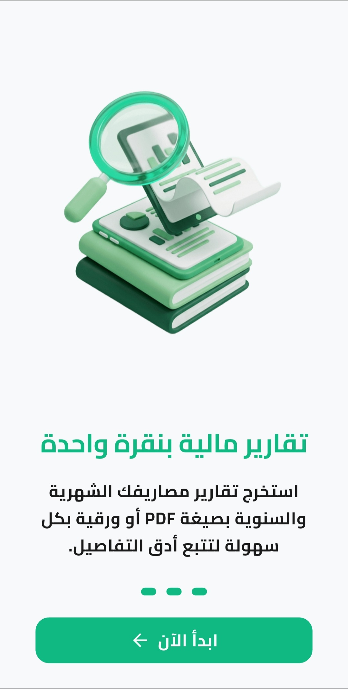

### 🏠 2. Financial Dashboard & Entry Management

  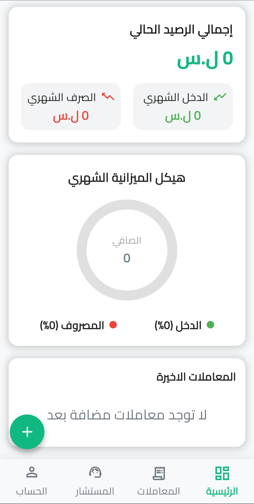
  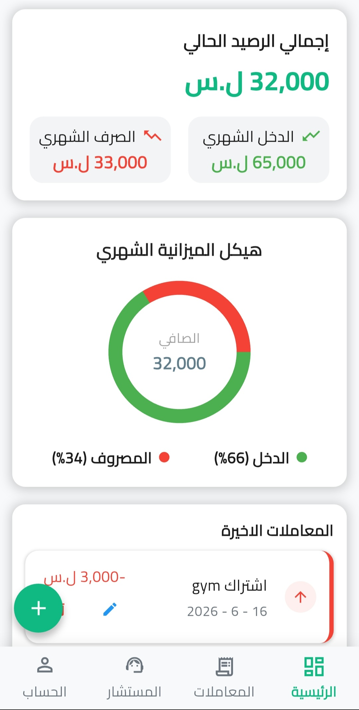
  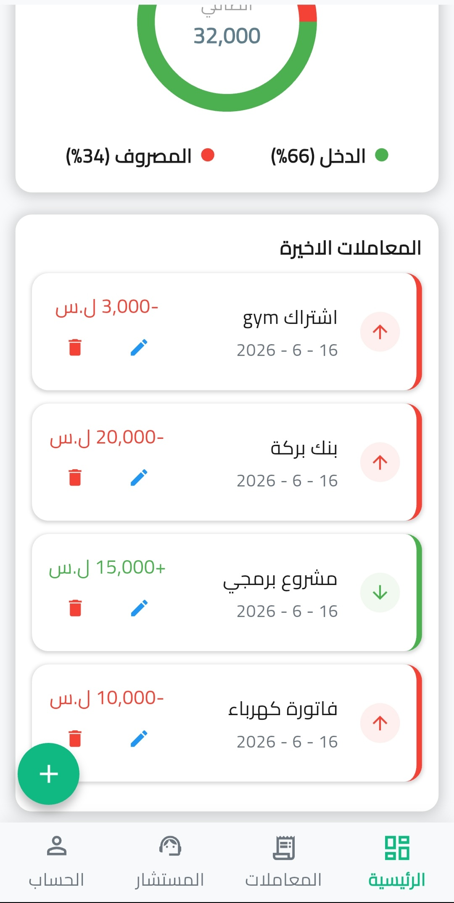

  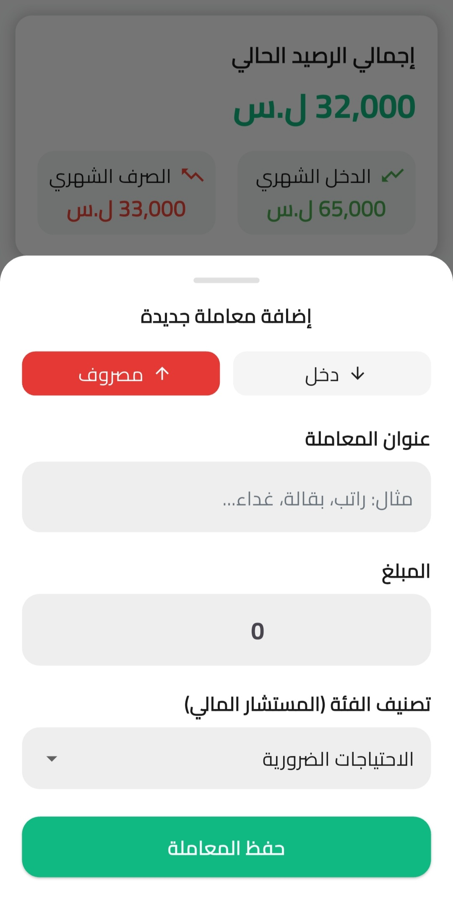
  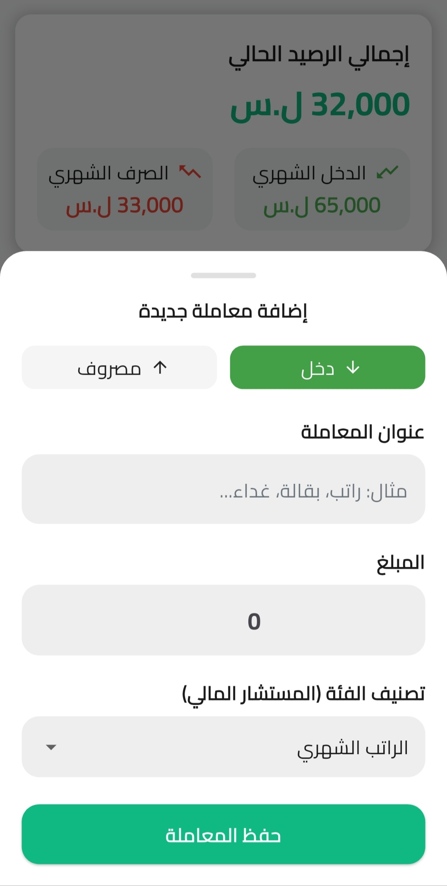

### 📊 3. Unified Transactions Ledger Center (Filtering, Smart Search & CRUD)
*A comprehensive, single-screen financial hub handling interactive lists, multi-tier filtering, localized intelligent search, and direct record management:*

  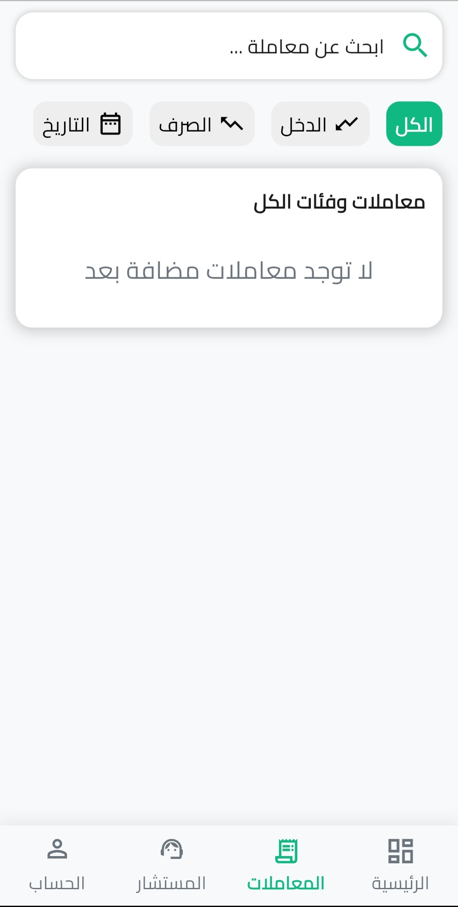
  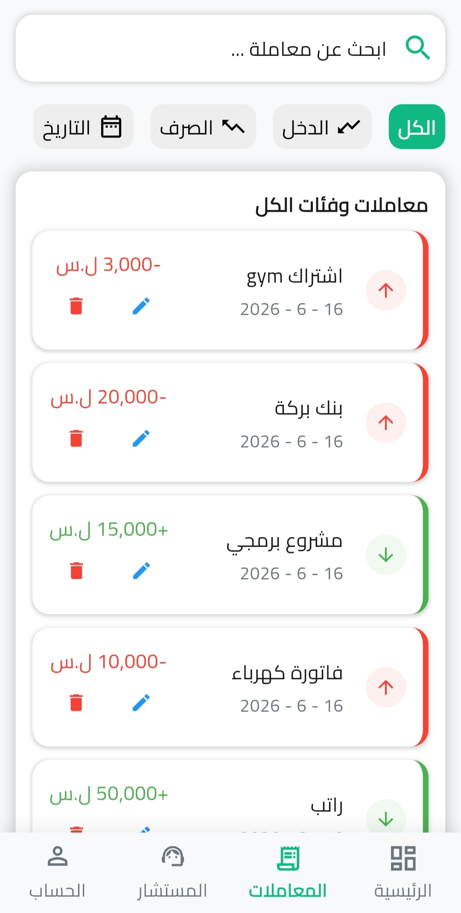
  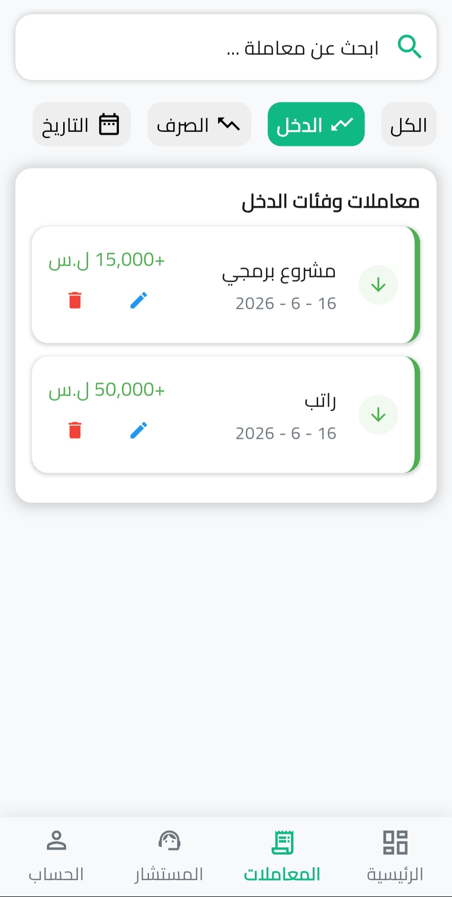

  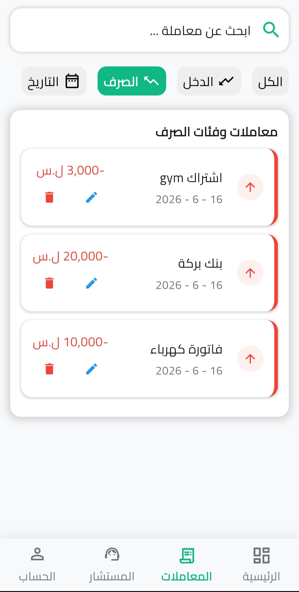
  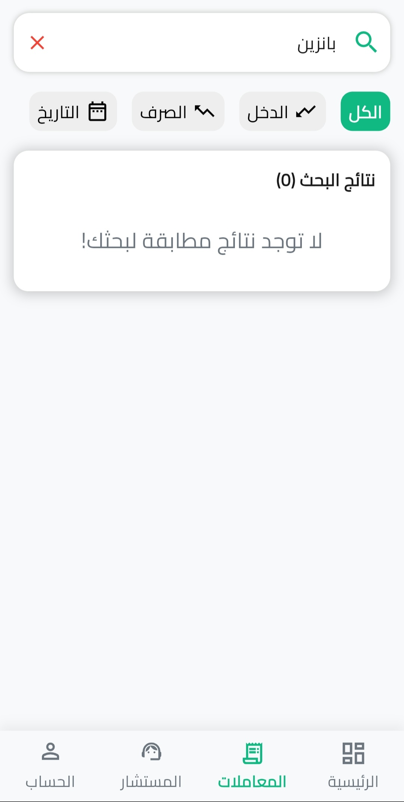
  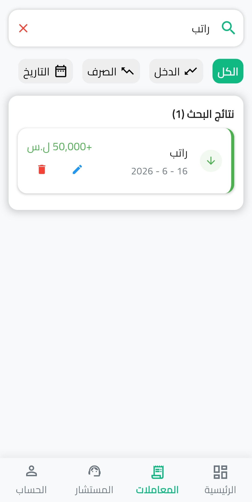

  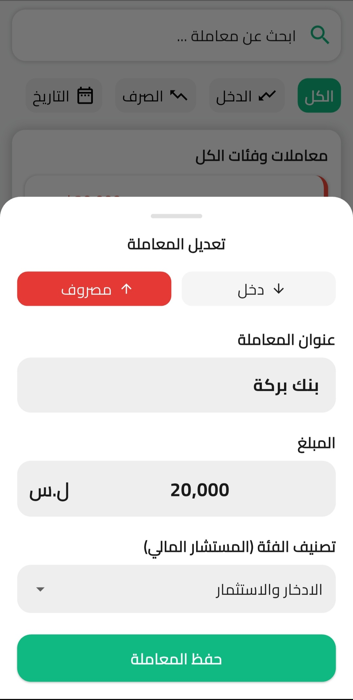
  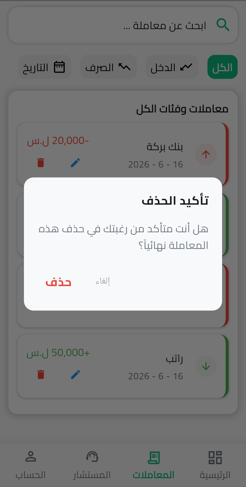

### 🧠 4. Financial Advisor Center

  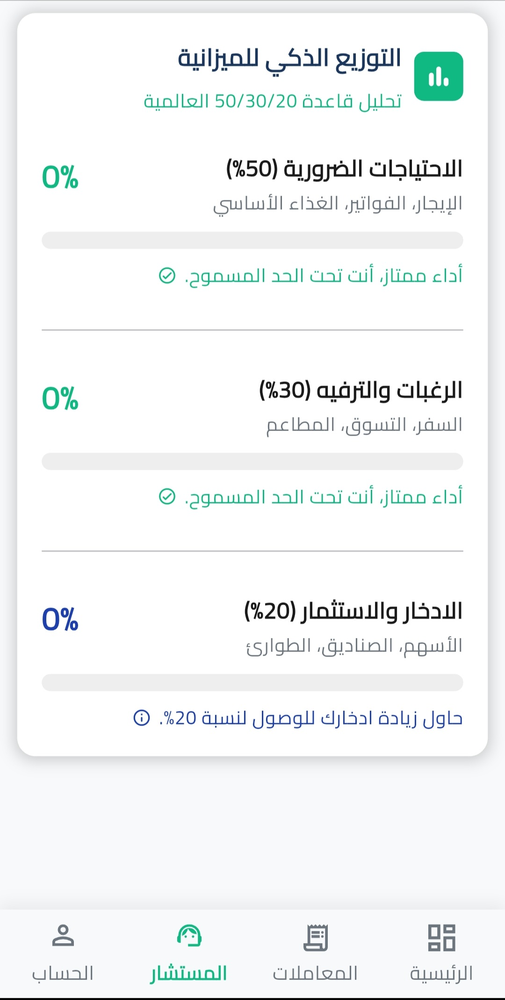
  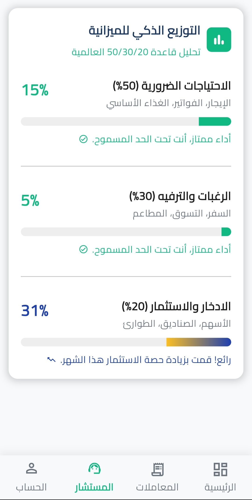

### 📄 5. Financial Reports Center (Report Viewer)

  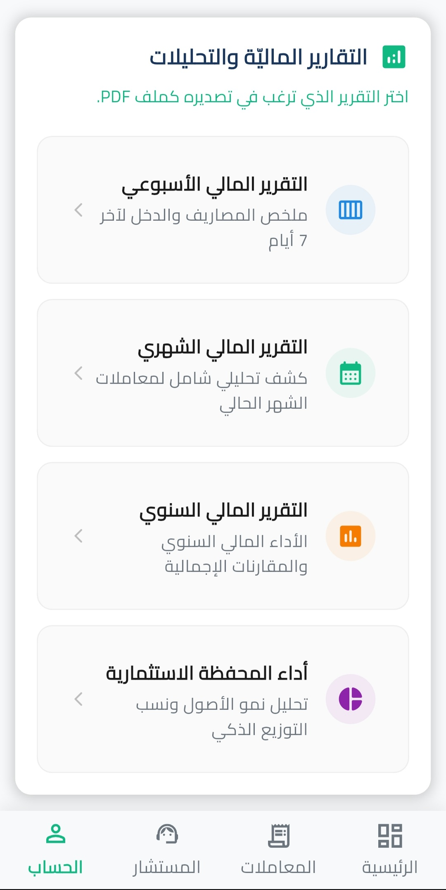
  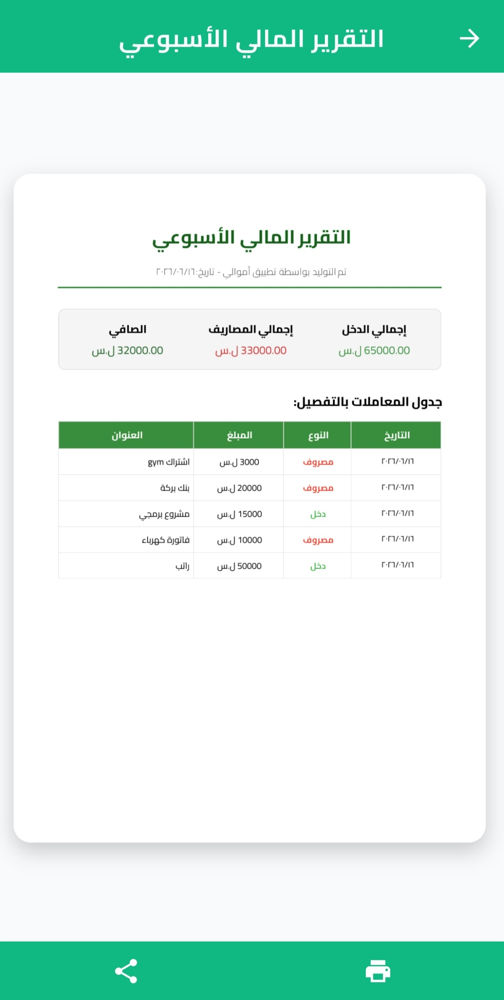

---
## 🛠️ Technical Stack & Implementation

* **Architecture:** Strictly built on **Clean Architecture** (Presentation, Domain, Data layers) to ensure decoupled, highly testable, and maintainable code.
* **State Management:** Powered by **Cubit (Bloc)** for predictable, reactive UI transitions and strict business logic isolation.
* **Local Persistence:** Integrated **Isar DB** (NoSQL) for ultra-fast, secure, and reactive **CRUD operations** running entirely offline.
* **Dependency Injection:** Utilized **GetIt** as a service locator for efficient memory management and clean contract decoupling.
* **Reporting & Printing:** Implemented `pdf` & `printing` packages to generate vector financial documents with full native print and share support.

---

## 🚀 Key Features

* **Offline-First Security:** Zero network dependency—all data is processed and stored locally on the device.
* **Dynamic Budgeting Sheets:** Seamless switching between customized Income and Expense inputs via interactive bottom sheets.
* **All-in-One Ledger Hub:** A single-screen transaction ledger with dynamic category filtering, multi-state real-time search, and inline CRUD actions (Edit/Delete).
* **Automated Financial Advisor:** Smart analytical module that processes ledger data to provide strategic cash flow advice.
* **Financial Reports Center:** Interactive multi-page **PDF Viewer** featuring high-performance pinch-to-zoom, cross-app sharing, and native printing for **Weekly, Monthly, Yearly, and Portfolio** summaries.

---
*Developed with ❤️ by **Amaar Abd Alrahman***
